# IBM Hybrid Cloud Workshop

# ToolChain Lab with IKS

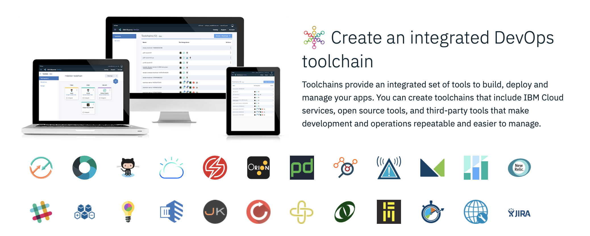
+++

# 1. Toolchain Overview

With **Continuous Delivery**, you can build, test, and deliver applications by using DevOps practices and industry-leading tools.

The Continuous Delivery service supports your DevOps workflows:

- You can create integrated DevOps open toolchains to enable tool integrations that support your development, deployment, and operations tasks.

  A toolchain is an integrated set of tools that you can use to collaboratively develop, build, deploy, test, and manage applications and make operations repeatable and easier to manage. Toolchains can include open source tools, IBM Cloud services, such as IBM® Cloud DevOps Insights, and third-party tools, such as GitHub, PagerDuty, and Slack.

  DevOps Insights is available only in the US South region.

- Deliver continuously by using automated pipelines.

  Automate builds, unit tests, deployments, and more. Build, test, and deploy in a repeatable way with minimal human intervention. Be ready to release into production at any time.

- Edit and push your code from anywhere by using the web-based IDE.

  Create, edit, run, and debug, and complete source-control tasks in GitHub. Seemlessly move from editing your code to deploying it to production.

- Collaborate with your team and manage your source code with a Git repository (repos) and issue tracker that is hosted by IBM and built on GitLab Community Edition.

  Manage Git repos through fine-grained access controls that keep code secure. Review code and enhance collaboration through merge requests. Track issues and share ideas through the issue tracker. Document projects on the wiki system.

Open **toolchains** are available in the Public and Dedicated environments on IBM® Cloud. You can create a toolchain in two ways: use a template to create a toolchain or create a toolchain from an app. As a starting point, you can use a toolchain template. Depending on the template that you use, you can create a toolchain that has a specific set of tool integrations or an empty toolchain that you can add tool integrations to.

On IBM Cloud Public, depending on the template or toolchain that you use, the toolchain might include a GitHub or Git repository (repo) that is populated with app starter code and a preconfigured delivery pipeline. When you push changes to the toolchain's repo, the delivery pipeline automatically builds and deploys the app to IBM Cloud.

On IBM Cloud Dedicated, depending on the template or toolchain that you use, the toolchain might include a GitHub or GitHub Enterprise repo that is populated with app starter code and a preconfigured delivery pipeline. When you push changes to the toolchain's GitHub or GitHub Enterprise repo, the delivery pipeline automatically builds and deploys the apps to IBM Cloud.

### Objectives 

In this lab, you create a toolchain from a template that contains a specific set of tool integrations and code to develop and deploy a sample Cloud Foundry app that is written in Node.js. The toolchain is preconfigured for continuous delivery, source control, issue tracking, and online editing. After you create the toolchain, you change the app's code and push the change to the Git Repos and Issue Tracking repository (repo). When you push changes to your repo, the delivery pipeline automatically builds and deploys the code that is in the repo.

# 2. Prerequisites 

Before you can run all the labs, you should prepare your environment to execute those labs.

Labs are running on the **IBM Cloud** (ex Bluemix). 

> You should have an **IBM account**
>
> This account can be a lite account, a trial account or a Pay as You Go Account.

See the PrepareLab.md for more information.

# 3. Create the Toolchain

### Task 1 : Login to IBM Cloud

Open a browser window and type http://cloud.ibm.com

### Task 2 : Access the Dashboard

Click LOG IN and then enter your login credentials on the IBM id page and click Sign in. You should see your dashboard view.

### Task 3 : Hamburger Menu

Click on **Menu** on the top left side of the screen.

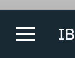

### Task 4 : DevOps page

From the menu, find and click to the **DevOps** entry. The following page appears:

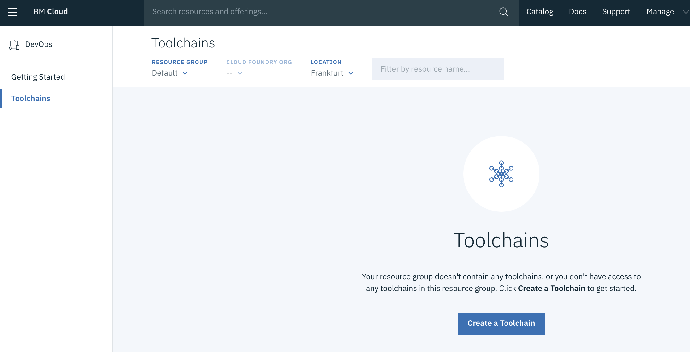

Click **Create a Toolchain**

### Task 5 : Toochain Templates

From the list of toolchain templates, click on **Develop a Kubernetes App with Helm**

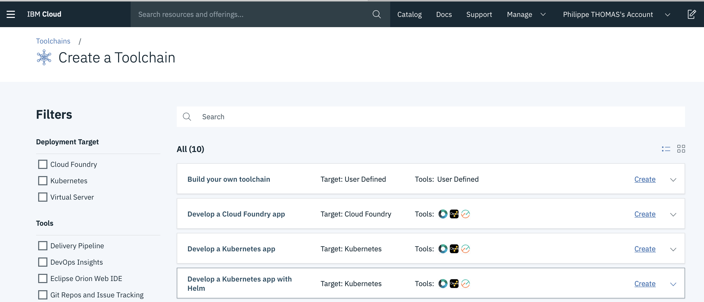

### Task 6 : Kubernetes App with Helm

On the creation page, review the diagram of the toolchain that you are about to create. The diagram shows each tool integration in its lifecycle phase in the toolchain. Click **Create** on the right side.

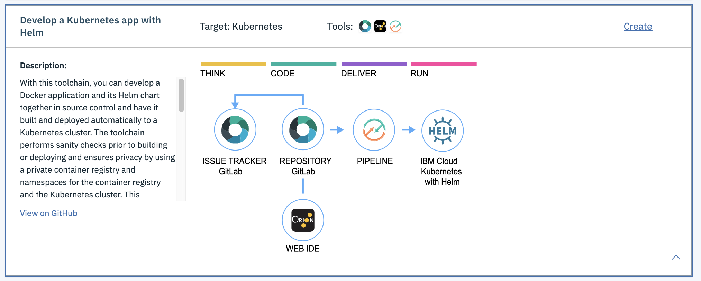

### Task 7 : Gitlab Repos

Review the default information for the toolchain settings. The toolchain's name identifies it in IBM Cloud. If you want to use a different name, region, or organization, change them.

Change the name of the toochain to **simple-toolchain-myappYYY** where YYY are your initials.

**Go to the bottom of the page to the "Tool Integrations"**

Then in the tool Integration section, as you can see, there are 3 icons representing the **Git repos**, **Orion** and the **Pipeline**. 

On the Git repos part, we are going to clone a github repo to a new gitlab repos.

> Don't yet click create

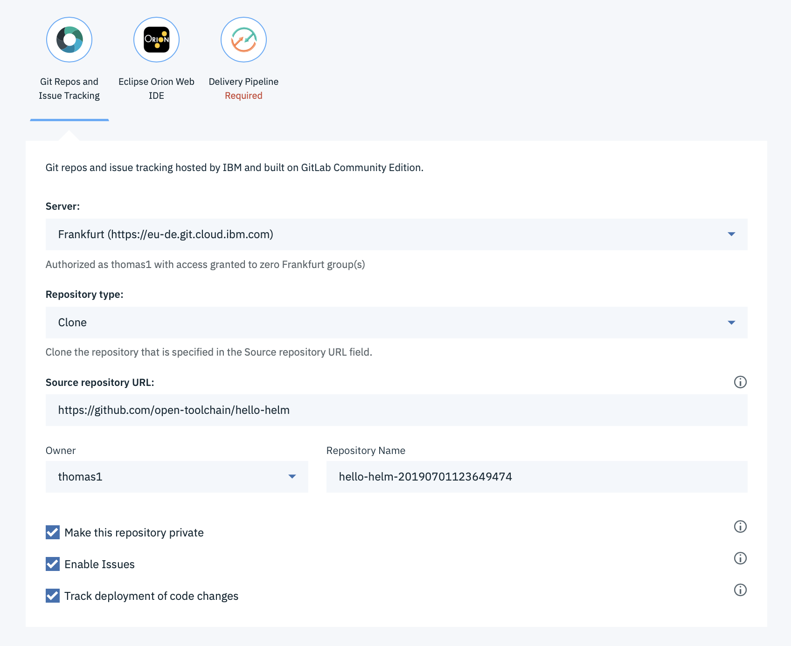

### Task 8 : Orion

Click on the Orion icon. This section explains that we are going to use an open source web IDE.

For more information about Orion, see https://orionhub.org/mixloginstatic/landing.html?redirect=https%3A%2F%2Forionhub.org%2F&key=FORMOAuthUser

### Task 9 : Pipeline

On the pipeline section, you will change the API Key field.
Click on **create** button (middle right) for a **new API Key**.

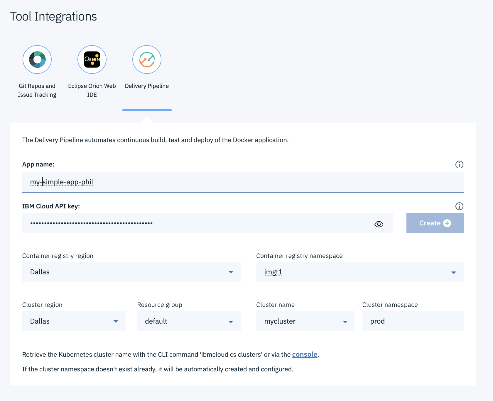

Change the App name, the Container registry region, the Container registry name space, the cluster region, the cluster name (**mycluster**). You can find all these values in the IKS pages in the IBM Cloud UI. 

Then Click on the **Create button at the bottom** of the page.

After a short period of time, the following screen indicates that the toolchain has been created.

The toolchain is ready! You have 4 tools:

- Issues to track your problems
- GitLab to manage you code 
- Orion to edit your code
- Delivery Pipeline to manage your deployment

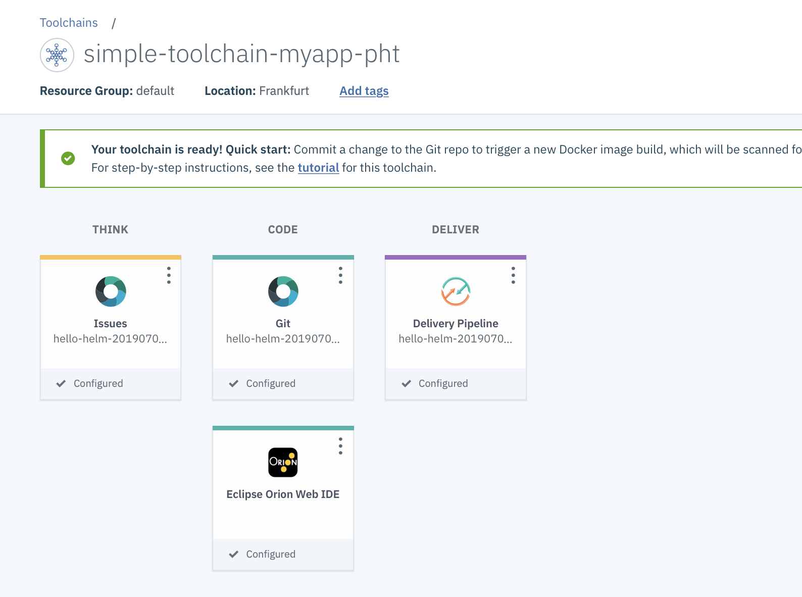

# 4. Modify the application

### Task 1 : Access Orion

In this tutorial, you will use the Eclipse **Orion** Web IDE to modify source code. When you edit in the Web IDE, your changes are saved to your cloud workspace. When you commit a change, it is saved to a Git repo on the cloud. When you push or sync a change, it is pushed to the origin Git repo (remote repo). Synching a change also saves the change from the remote repo to your Git repo and workspace on the cloud. You can also use the GitLab editor or your favorite editor to modify your app's code.

On the toolchain Overview page, click **Eclipse Orion Web IDE**. Your GitHub repo is automatically loaded in your workspace.

The name of the repo that is shown in the file navigator is the name that you specified for the sample GitHub Enterprise repo when you created the toolchain.

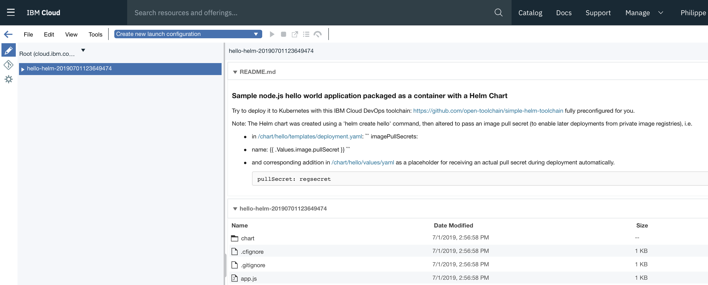

### Task 2 : Navigate into the repo

In the file navigator, expand the repo for your current toolchain and go to the **app.js** file in the public folder. 

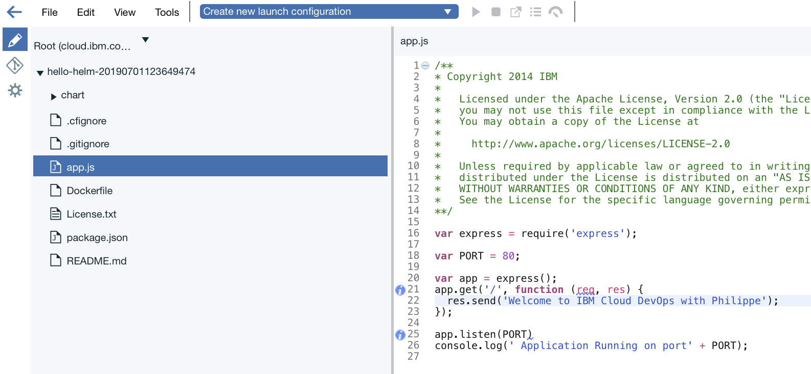

### Task 3 : Modify the file

Change the res.send line to change the text that is displayed by the deployed app. Your changes are automatically saved.

From the Eclipse Orion Web IDE menu, click the Git icon

In the Working Directory Changes section, type a commit message and make sure that the changed file is selected. You can expand app.js section to see the changes. Note that the changes are highlighted: the original content is red and the changed content is in green. 

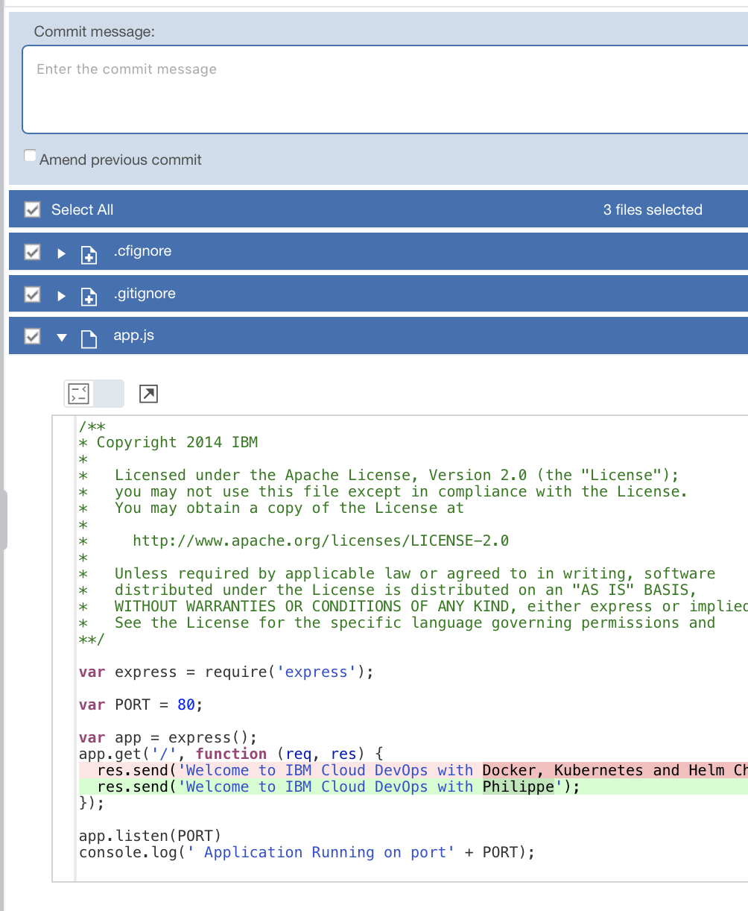

### Task 4 : Commit and Push

Add a **commit message** and at the top right, click **Commit** to put the changes in the local master branch. On the left side of the page, your commit change will be added. 

To push the changes in the origin/master branch, click **Push**. The origin/master branch is used by the pipeline. Your changes are automatically built and deployed by the pipeline.

Return quickly to the toolchain Overview page by clicking the top left arrow.

### Task 5 : Pipeline

Click **Delivery Pipeline** to watch the stages run in response to your commit.

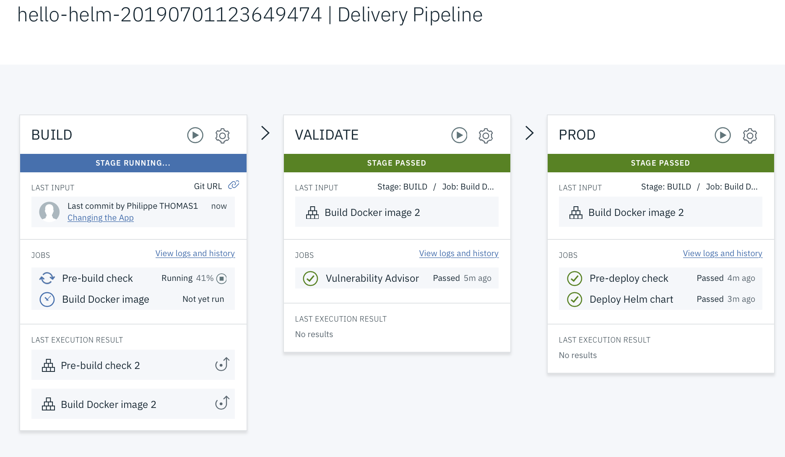

You can look at the logs during the stages by clicking on the **View Logs and History** link.

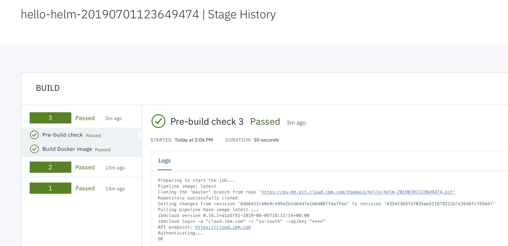

After a while, you should see your **PROD** stage has been passed.

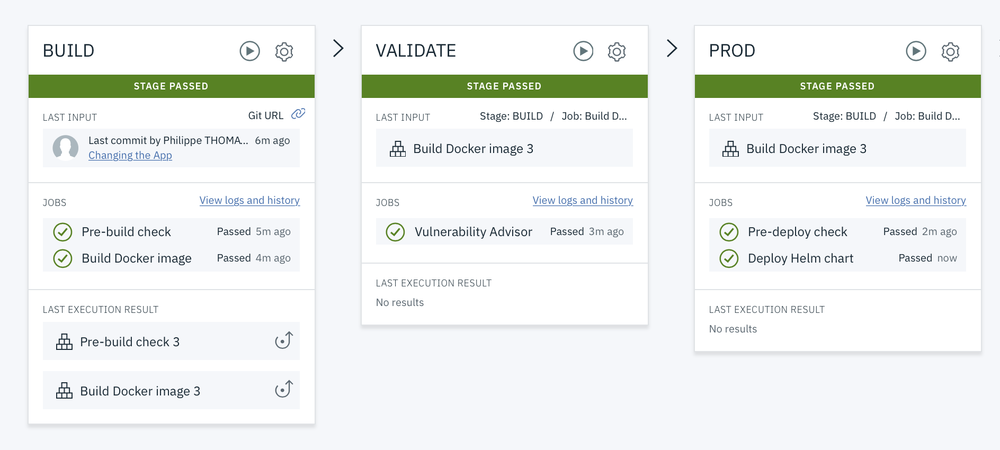

When the pipeline process is completed, go back to your app's **PROD stage**, click on **View Logs and History** and then click on the **Deploy Helm chart** log: 

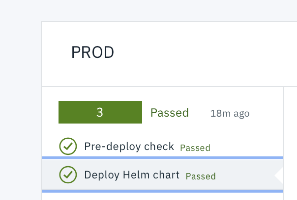

 And go to the **end of the log** :

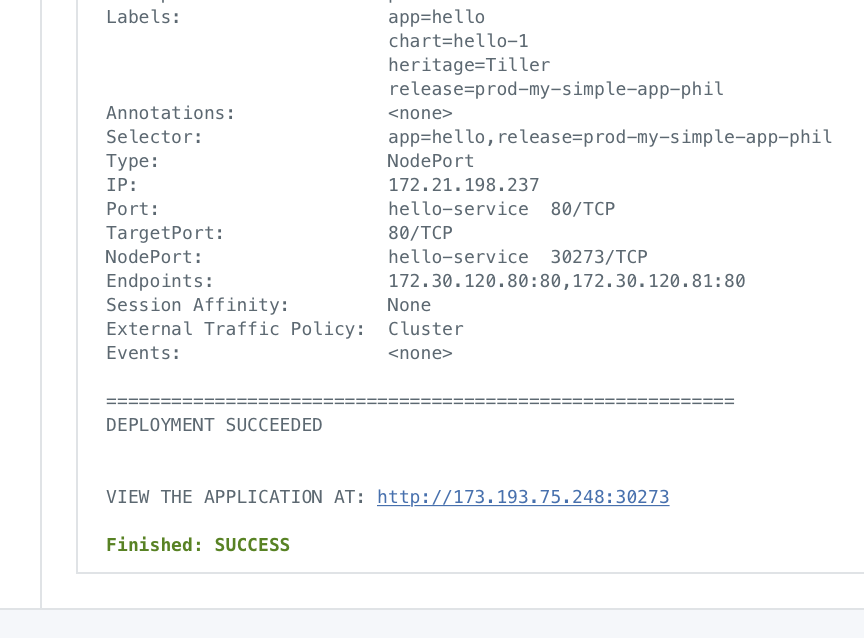

Copy and paste the link to your browser.

You should see your change:

#  Results
Successful exercise ! 

You learned how to continuously integrate and deploy an app to IBM Cloud by using a **toolchain**. You created a toolchain from a template that included a GitHub repo with a Node.js Hello World app and a delivery pipeline. You changed your app's code by using the Eclipse Orion Web IDE and added a stage to the pipeline. When you pushed the updated code, your change was built and deployed automatically.

##End of Lab

#IBM Hybrid Cloud Workshop

